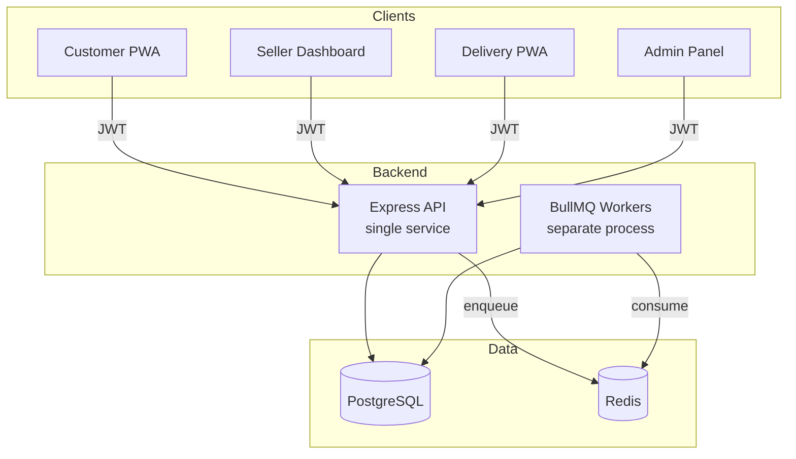
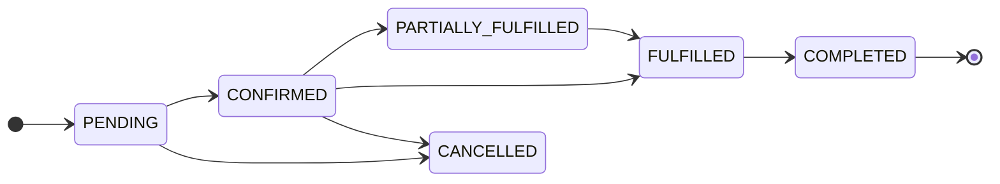
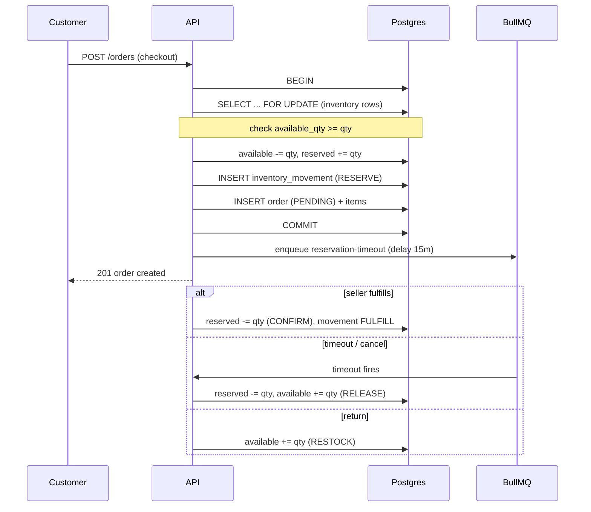
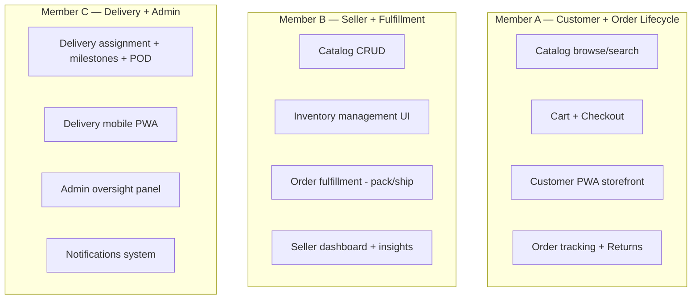

# E-Commerce Ecosystem — Project Documentation

A full-fledged commerce platform (mini Amazon/Flipkart) built as a serious engineering project. One backend API serves **four separate applications**: Customer storefront, Seller dashboard, Delivery partner app, and Admin/ops panel.

> This document is the single source of truth for the team. Read it fully before writing any code. It explains **what we are building**, **the tech stack**, **the architecture**, **the phases**, and **who does what**.

---

## Table of Contents

1. [Project Overview](#1-project-overview)
2. [The Four Applications](#2-the-four-applications)
3. [Tech Stack](#3-tech-stack)
4. [Critical Non-Negotiables](#4-critical-non-negotiables)
5. [System Architecture](#5-system-architecture)
6. [Monorepo Structure](#6-monorepo-structure)
7. [Core Entities (Data Model)](#7-core-entities-data-model)
8. [The Four State Machines](#8-the-four-state-machines)
9. [Inventory Reservation Model](#9-inventory-reservation-model)
10. [Role-Based Access Control (RBAC)](#10-role-based-access-control-rbac)
11. [Development Phases](#11-development-phases)
12. [Team Roles & Task Division](#12-team-roles--task-division)
13. [Collaboration Rules](#13-collaboration-rules)
14. [Definition of Done](#14-definition-of-done)

---

## 1. Project Overview

We are building a **complete commerce ecosystem** — not disconnected screens, but a coherent end-to-end order lifecycle that flows across four roles:

> **Customer places order → Seller fulfills → Delivery partner delivers → Order completes**, with returns and cancellations correctly reversing inventory and state.

The evaluation focus is on **correctness and clean end-to-end flows**, not the number of features.

---

## 2. The Four Applications

| # | Application | Users | Key Capabilities | Type |
|---|-------------|-------|------------------|------|
| 1 | **Customer Storefront** | Buyers | Browse, search, cart, checkout, order tracking, returns | PWA |
| 2 | **Seller Dashboard** | Sellers | Catalog management, inventory, order fulfillment, insights | Web |
| 3 | **Delivery Partner App** | Delivery agents | Assignments, delivery milestones, proof of delivery | Mobile-first PWA |
| 4 | **Admin / Ops Panel** | Admins | Oversight of all users, orders, disputes, overrides | Web |

All four talk to **one shared backend API**.

---

## 3. Tech Stack

### Backend
| Concern | Technology |
|---------|-----------|
| Runtime | Node.js |
| Framework | Express |
| Database | PostgreSQL |
| ORM | Prisma |
| Authentication | JWT + bcrypt |
| Authorization | Role-based middleware |
| Validation | Zod |
| Background jobs | BullMQ + Redis |

### Frontend (all four apps)
| Concern | Technology |
|---------|-----------|
| Library | React |
| Build tool | Vite |
| Server state | TanStack Query |
| PWA | vite-plugin-pwa |
| Local UI state | React hooks (no Redux) |

### Tooling & Deployment
| Concern | Technology |
|---------|-----------|
| Monorepo | pnpm workspaces |
| Frontends hosting | Vercel (4 projects) |
| Backend + Worker + DB + Redis | Railway |
| Migrations | Prisma Migrate |
| Linting/Formatting | ESLint + Prettier |

---

## 4. Critical Non-Negotiables

These are the **evaluation focus**. Everything else is secondary.

1. **Separate State Machines** — `order_status`, `payment_status`, `fulfillment_status`, and `delivery_status` are tracked **independently** and never merged into one field.

2. **Inventory Correctness** — A reservation model: **reserve** stock on order placement, **confirm** on fulfillment, **release** on cancellation/timeout, **restock** on return. Concurrent purchases handled with row-level locking (`SELECT ... FOR UPDATE`) inside transactions.

3. **Role-Based Access Control** — Strictly enforced permissions across all 4 roles.

4. **End-to-End Flows** — A coherent order lifecycle from customer → seller → delivery → completion. Not disconnected screens.

5. **Production Hygiene** — Realistic seed data, graceful error handling, validation, pagination, and mobile responsiveness.

---

## 5. System Architecture

Four frontends talk to **one API**, which uses Postgres + Redis. Background workers share the API codebase but run as a **separate process** so long jobs never block HTTP requests.



### Backend Layered Structure

```
apps/api/src/
├── index.ts                 # HTTP server bootstrap
├── worker.ts                # BullMQ worker bootstrap (separate process)
├── config/                  # env parsing (zod), prisma client, redis client
├── middleware/
│   ├── auth.ts              # verify JWT -> req.user
│   ├── rbac.ts              # requireRole(), requireOwnership()
│   ├── validate.ts          # zod body/query/params validation
│   └── errorHandler.ts      # central error -> HTTP mapping
├── modules/                 # feature-first: each = router + service + schema
│   ├── auth/
│   ├── catalog/             # categories, products, variants, images
│   ├── inventory/           # reservation engine (FOR UPDATE txns)
│   ├── cart/
│   ├── orders/              # lifecycle orchestration
│   ├── fulfillment/         # seller-side fulfillment, shipments
│   ├── delivery/            # assignments, milestones, POD
│   ├── returns/
│   └── notifications/
├── core/
│   ├── stateMachines/       # pure transition tables + guards
│   └── db/                  # transaction helpers, withLock()
├── queues/                  # BullMQ queue definitions + processors
└── prisma/                  # schema.prisma + seed.ts
```

**Module pattern:** each module = `*.router.ts` (HTTP) → `*.service.ts` (business logic + transactions) → `*.schema.ts` (Zod). Controllers stay thin; all business invariants live in services.

---

## 6. Monorepo Structure

```
major-project/
├── package.json                 # workspace root, shared scripts
├── pnpm-workspace.yaml
├── .env.example
├── apps/
│   ├── api/                     # Express + Prisma + BullMQ
│   ├── customer/                # React PWA
│   ├── seller/                  # React dashboard
│   ├── delivery/                # React mobile PWA
│   └── admin/                   # React ops panel
└── packages/
    ├── shared-types/            # TS types shared FE<->BE (status enums, DTOs)
    ├── api-client/              # typed fetch wrapper + TanStack Query hooks
    └── ui/                      # shared React components
```

**Key idea:** the state-machine enums live **once** in `packages/shared-types` and are imported by both the API and every frontend, so a status string can never drift.

---

## 7. Core Entities (Data Model)

| Entity | Purpose |
|--------|---------|
| `users` | All users with a `role` field |
| `addresses` | User shipping/billing addresses |
| `seller_profiles` | Seller-specific data |
| `delivery_partner_profiles` | Delivery agent data |
| `categories` | Product categories |
| `products` | Product catalog |
| `product_variants` | Variants (size, color, etc.) |
| `product_images` | Product images |
| `inventory` | `available_qty` + `reserved_qty` per variant |
| `inventory_movements` | Audit trail of every stock change |
| `carts` / `cart_items` | Shopping cart |
| `wishlist_items` | Saved items |
| `orders` | Separate `order_status` & `payment_status` |
| `order_items` | Per-item `fulfillment_status` |
| `order_status_history` | Audit trail of order state changes |
| `shipments` | Shipment records |
| `deliveries` | With `delivery_status` |
| `delivery_status_history` | Audit trail of delivery state changes |
| `returns` | Return requests |
| `notifications` | User notifications |

---

## 8. The Four State Machines

Each is a **pure transition table** in `core/stateMachines/`. Services call `assertTransition(current, next)` before writing, and append to the relevant history table in the **same transaction**.

| Machine | Field | Owner | Sample States |
|---------|-------|-------|---------------|
| **Order** | `orders.order_status` | orders service | PENDING → CONFIRMED → PARTIALLY_FULFILLED → FULFILLED → COMPLETED / CANCELLED |
| **Payment** | `orders.payment_status` | payments (mock gateway) | PENDING → AUTHORIZED → PAID → REFUNDED / FAILED |
| **Fulfillment** | `order_items.fulfillment_status` | fulfillment service (per item) | UNFULFILLED → PACKED → SHIPPED → DELIVERED / CANCELLED |
| **Delivery** | `deliveries.delivery_status` | delivery service | ASSIGNED → PICKED_UP → IN_TRANSIT → OUT_FOR_DELIVERY → DELIVERED / FAILED |

They evolve **independently** — e.g. an order can be `PAID` while items are still `UNFULFILLED`. The order becomes `COMPLETED` only when derived from item states + delivery.



---

## 9. Inventory Reservation Model

Every stock mutation happens inside a **transaction with `SELECT ... FOR UPDATE`** on the inventory row. This guarantees two concurrent buyers of the last unit cannot both succeed. Every change writes an `inventory_movements` audit row.



**Movement types:** `RESERVE` / `RELEASE` / `FULFILL` / `RESTOCK` / `ADJUST`.

---

## 10. Role-Based Access Control (RBAC)

```
JWT payload: { userId, role }
        │
   auth middleware ──> req.user
        │
   rbac middleware:
     requireRole('seller')                 // coarse: route-level
     requireOwnership(resource, req.user)   // fine: "your own resources only"
```

| Role | Can Access |
|------|-----------|
| **customer** | Own cart, orders, returns, addresses, wishlist |
| **seller** | Own products/variants/inventory, order items for their products, shipments |
| **delivery_partner** | Own delivery assignments, milestones, POD upload |
| **admin** | Read/write across all entities, disputes, overrides |

**Ownership is enforced in the service query** (`WHERE seller_id = req.user.id`), not just middleware — so it cannot be bypassed.

---

## 11. Development Phases

**Guiding principle:** Foundation is shared and sequential; features are parallel.

### Phase 0 — Foundation (everyone, together)
Lock the shared contract. No parallel feature work yet.
- Monorepo scaffold (pnpm workspaces, root scripts, `.env.example`)
- **Prisma schema (all entities)** — the most important artifact, reviewed together
- The 4 state machines + history tables
- Shared enums in `packages/shared-types`
- Auth + RBAC middleware
- Seed script (realistic users for all 4 roles)
- CI + shared ESLint/Prettier

**Deliverable:** anyone can register/login as any role, DB migrates, seed runs.

### Phase 1 — Inventory + Order Core (the graded heart)
Hardest, highest-risk part. One strong owner drives it; others review closely.
- Inventory reservation engine (`FOR UPDATE`, movements)
- Reservation-timeout BullMQ queue
- Order placement service (checkout → reserve → PENDING)
- Order lifecycle transitions + history

**Deliverable:** place an order via API; stock reserves correctly under concurrency; timeout releases it. Proven with a script before any UI.

### Phase 2 — Vertical Feature Slices (fully parallel)
Each person owns backend module(s) + the matching frontend.

### Phase 3 — Integration & End-to-End Flow
Stitch the hops together, one flow at a time, as a group.

### Phase 4 — Polish & Deploy
Pagination, error handling, PWA config, responsiveness, seed expansion, deployment.

| Phase | Rough Share |
|-------|-------------|
| 0 Foundation | ~15% (all together) |
| 1 Inventory/Order core | ~15% (lead-driven) |
| 2 Feature slices | ~45% (parallel) |
| 3 Integration | ~15% (all) |
| 4 Polish/deploy | ~10% |

---

## 12. Team Roles & Task Division

Three members: **Member A**, **Member B**, **Member C**. (Replace with real names.)

### Phase 0 Split
| Member | Responsibility |
|--------|----------------|
| **A** | Prisma schema + migrations + seed data |
| **B** | Auth + RBAC + validation middleware |
| **C** | Monorepo scaffold + shared-types + api-client + shared UI kit |

### Phase 1 (Lead: A)
| Task | Owner |
|------|-------|
| Inventory reservation engine | **A** |
| Reservation-timeout queue | **A** |
| Order placement service | **A** (pair with B) |
| Order lifecycle + history | **A** |

While A builds the core, **B and C build their app shells** (not idle).

### Phase 2 — Ownership by Role/App
| Member | Backend Modules | Frontend App |
|--------|-----------------|--------------|
| **A** | catalog (read), cart, orders, returns | **Customer PWA** |
| **B** | catalog (write), inventory UI, fulfillment, shipments | **Seller Dashboard** |
| **C** | delivery, notifications, admin endpoints | **Delivery PWA + Admin Panel** |

**Why this split works:** the order lifecycle flows **A → B → C** in real life, so each person owns one hop of the pipeline. The shared contract was locked in Phase 0, so integration is just wiring.



### Phase 4 Split
| Task | Owner |
|------|-------|
| Pagination, error handling, validation | each owns their module |
| PWA config (customer + delivery) | A + C |
| Mobile responsiveness pass | all, own screens |
| Realistic seed data expansion | A |
| Deploy (Vercel ×4 + Railway) | B |
| README / demo script / architecture doc | C |

---

## 13. Collaboration Rules

1. **Phase 0 must merge before anyone starts Phase 2.** Non-negotiable.
2. **Enums/DTOs only change via `packages/shared-types` + group agreement.** No local status strings anywhere.
3. **One owner per module.** Cross-module changes go through the owner via PR review.
4. **Feature branches per slice.** Small PRs, each reviewed by at least one other member.
5. **Core changes** (`inventory`, `stateMachines`) require Member A's review, since everything depends on them.
6. **Commit discipline:** one commit per logical unit, with clear messages.

---

## 14. Definition of Done

A feature is "done" only when:

- [ ] Input is validated (Zod) at the boundary
- [ ] RBAC + ownership is enforced in the service query
- [ ] Any state change goes through a state-machine guard + writes history
- [ ] Any stock change is inside a `FOR UPDATE` transaction + writes a movement
- [ ] Lists are paginated
- [ ] Errors are handled gracefully (central error handler)
- [ ] UI is mobile-responsive
- [ ] Reviewed and merged via a small PR

---

**End of document.** Keep this updated as decisions evolve.
