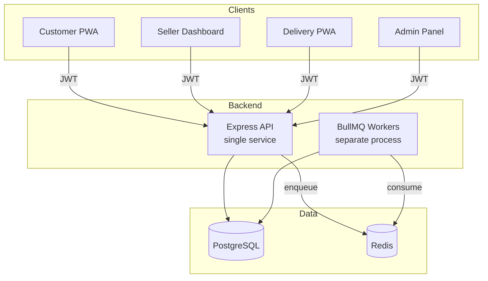
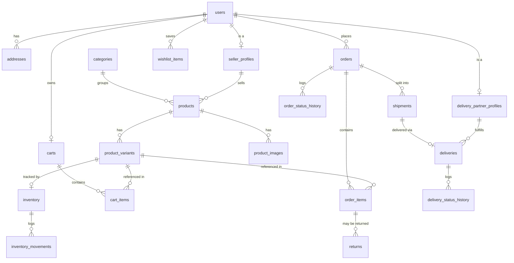
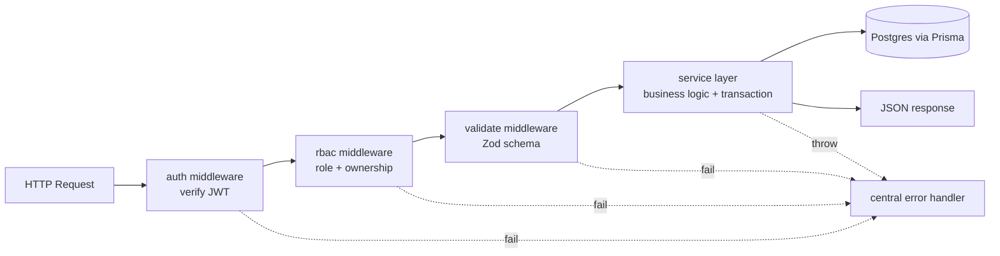
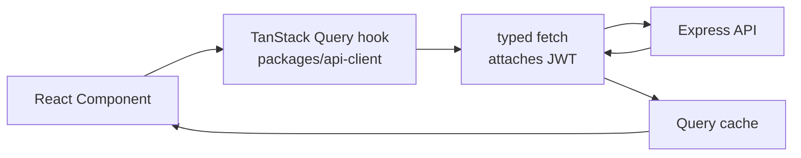
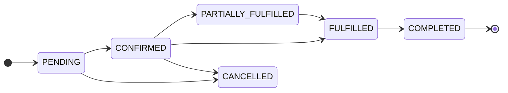
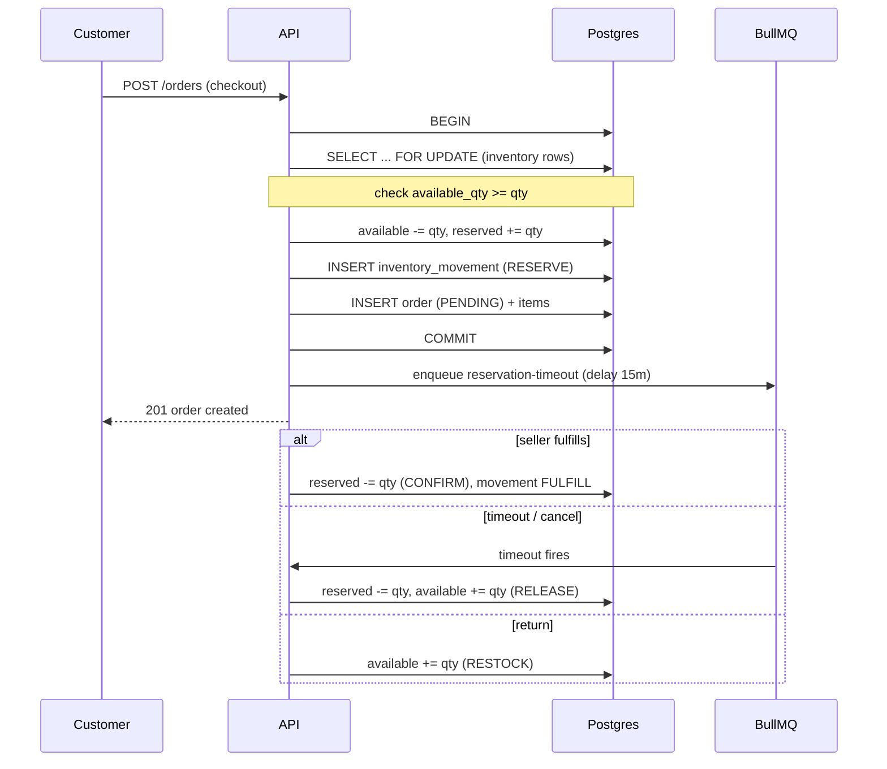
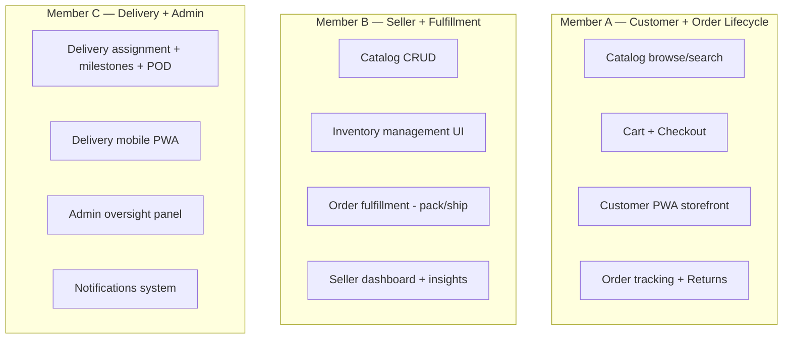

# E-Commerce Ecosystem — Project Documentation

A full-fledged commerce platform (mini Amazon/Flipkart) built as a serious engineering project. One backend API serves **four separate applications**: Customer storefront, Seller dashboard, Delivery partner app, and Admin/ops panel.

> This document is the single source of truth for the team. Read it fully before writing any code. It explains **what we are building**, **the tech stack**, **the architecture**, **the phases**, and **who does what**.

---

## Table of Contents

- [E-Commerce Ecosystem — Project Documentation](#e-commerce-ecosystem--project-documentation)
  - [Table of Contents](#table-of-contents)
  - [1. Project Overview](#1-project-overview)
  - [2. The Four Applications](#2-the-four-applications)
  - [3. Tech Stack (with rationale)](#3-tech-stack-with-rationale)
    - [3.1 Backend](#31-backend)
    - [3.2 Frontend (all four apps use the same stack)](#32-frontend-all-four-apps-use-the-same-stack)
    - [3.3 Tooling \& Deployment](#33-tooling--deployment)
    - [3.4 Why this stack fits *this* project](#34-why-this-stack-fits-this-project)
  - [4. Critical Non-Negotiables](#4-critical-non-negotiables)
  - [5. System Architecture](#5-system-architecture)
    - [Backend Layered Structure](#backend-layered-structure)
  - [6. Monorepo Structure](#6-monorepo-structure)
  - [7. Core Entities (Data Model)](#7-core-entities-data-model)
    - [Entity Relationship Overview](#entity-relationship-overview)
  - [8. Database Design \& Conventions](#8-database-design--conventions)
    - [Design Principles](#design-principles)
    - [Column \& Naming Conventions](#column--naming-conventions)
    - [Transaction \& Concurrency Rules](#transaction--concurrency-rules)
  - [9. API Design](#9-api-design)
    - [Conventions](#conventions)
    - [HTTP Status Code Usage](#http-status-code-usage)
    - [Representative Endpoints](#representative-endpoints)
    - [Request Lifecycle](#request-lifecycle)
  - [10. Frontend Design System](#10-frontend-design-system)
    - [Shared Foundations (`packages/ui` + `packages/shared-types`)](#shared-foundations-packagesui--packagesshared-types)
    - [Per-App Design Intent](#per-app-design-intent)
    - [UI/UX Principles](#uiux-principles)
    - [Frontend Data Flow](#frontend-data-flow)
  - [11. The Four State Machines](#11-the-four-state-machines)
  - [12. Inventory Reservation Model](#12-inventory-reservation-model)
  - [13. Role-Based Access Control (RBAC)](#13-role-based-access-control-rbac)
  - [14. Development Phases](#14-development-phases)
    - [Phase 0 — Foundation (everyone, together)](#phase-0--foundation-everyone-together)
    - [Phase 1 — Inventory + Order Core (the graded heart)](#phase-1--inventory--order-core-the-graded-heart)
    - [Phase 2 — Vertical Feature Slices (fully parallel)](#phase-2--vertical-feature-slices-fully-parallel)
    - [Phase 3 — Integration \& End-to-End Flow](#phase-3--integration--end-to-end-flow)
    - [Phase 4 — Polish \& Deploy](#phase-4--polish--deploy)
  - [15. Team Roles \& Task Division](#15-team-roles--task-division)
    - [Phase 0 Split](#phase-0-split)
    - [Phase 1 (Lead: A)](#phase-1-lead-a)
    - [Phase 2 — Ownership by Role/App](#phase-2--ownership-by-roleapp)
    - [Phase 4 Split](#phase-4-split)
  - [16. Collaboration Rules](#16-collaboration-rules)
  - [17. Definition of Done](#17-definition-of-done)

---

## 1. Project Overview

We are building a **complete commerce ecosystem** — not disconnected screens, but a coherent end-to-end order lifecycle that flows across four roles:

> **Customer places order → Seller fulfills → Delivery partner delivers → Order completes**, with returns and cancellations correctly reversing inventory and state.

The evaluation focus is on **correctness and clean end-to-end flows**, not the number of features.

---

## 2. The Four Applications

| # | Application | Users | Key Capabilities | Type |
|---|-------------|-------|------------------|------|
| 1 | **Customer Storefront** | Buyers | Browse, search, cart, checkout, order tracking, returns | PWA |
| 2 | **Seller Dashboard** | Sellers | Catalog management, inventory, order fulfillment, insights | Web |
| 3 | **Delivery Partner App** | Delivery agents | Assignments, delivery milestones, proof of delivery | Mobile-first PWA |
| 4 | **Admin / Ops Panel** | Admins | Oversight of all users, orders, disputes, overrides | Web |

All four talk to **one shared backend API**.

---

## 3. Tech Stack (with rationale)

> **The stack in one line:** **React** on the frontend, **Node.js** on the backend, and a **SQL** database (PostgreSQL). Below is every technology we use and, importantly, **why** we chose it over the alternatives.

### 3.1 Backend

| Concern | Technology | Why we use it (and why not the alternative) |
|---------|-----------|---------------------------------------------|
| **Runtime** | **Node.js** | JavaScript on both ends means one language for the whole team, shared types between frontend and backend, and a huge package ecosystem. Its non-blocking I/O model is ideal for an API that does lots of DB/network calls rather than heavy CPU work. *Alternative (Java/Spring, Go) rejected:* higher ceremony and a second language to learn for a JS-first team. |
| **Framework** | **Express** | Minimal, unopinionated, and the most widely documented Node web framework. It gives us full control over our own layered structure (router → service → schema) instead of forcing a convention. *Alternative (NestJS) rejected:* more magic/boilerplate than a small team needs; Express keeps the mental model simple. |
| **Database** | **PostgreSQL (SQL)** | Our domain is **highly relational** (users→orders→items→inventory→movements) and demands **ACID transactions** and **row-level locking (`SELECT ... FOR UPDATE`)** for inventory correctness. Postgres does all of this natively. *Alternative (MongoDB/NoSQL) rejected:* no strong multi-row transactional locking guarantees, and joins across our many relations would be painful and error-prone. **SQL is a hard requirement for this project.** |
| **ORM** | **Prisma** | Type-safe database access generated directly from a single `schema.prisma` file — the schema becomes the source of truth. Gives us autocomplete, compile-time query safety, painless migrations, and readable transaction APIs (`$transaction`). *Alternative (raw SQL / Knex / TypeORM) rejected:* raw SQL is error-prone at this scale; Prisma's generated types eliminate a whole class of bugs. We can still drop to raw SQL for the `FOR UPDATE` locks where needed. |
| **Authentication** | **JWT + bcrypt** | JWTs are stateless, so the single API can authenticate requests from all four apps without server-side sessions — perfect for a multi-client system. `bcrypt` is the industry-standard slow hash for storing passwords safely. |
| **Authorization** | **Role-based middleware** | We have four distinct roles with strict boundaries. Centralizing checks in middleware (`requireRole`, `requireOwnership`) keeps authorization consistent and auditable instead of scattered across handlers. |
| **Validation** | **Zod** | Validates and **infers TypeScript types** from a single schema, so request validation and types never drift. Runs at the trust boundary (every request) to reject bad input early. *Alternative (Joi) rejected:* Joi doesn't give first-class TS type inference. |
| **Background jobs** | **BullMQ + Redis** | Some work must happen **outside** the request (e.g. releasing reserved stock after a 15-min timeout, sending notifications, auto-assigning deliveries). BullMQ gives us reliable, delayed, and retryable jobs backed by Redis. *Alternative (cron) rejected:* cron can't do per-order delayed jobs with retries cleanly. |

### 3.2 Frontend (all four apps use the same stack)

| Concern | Technology | Why we use it |
|---------|-----------|---------------|
| **Library** | **React** | Component-based UI that lets us **share components across all four apps** (buttons, tables, status badges) via a common `packages/ui`. Massive ecosystem, and the whole team already knows it. *Alternative (Angular/Vue) rejected:* React's component reuse across four apps and shared-types integration is the smoothest for our monorepo. |
| **Build tool** | **Vite** | Near-instant dev server startup and hot reload, plus first-class PWA support. Much faster feedback loop than older bundlers. *Alternative (Create React App) rejected:* CRA is effectively deprecated and slow. |
| **Server state** | **TanStack Query** | Our screens are mostly **server data** (products, orders, deliveries). TanStack Query handles caching, background refetch, pagination, and cache invalidation for us — so we don't hand-roll loading/error/stale logic. *Alternative (Redux) rejected:* Redux is for complex client state we don't have; it would add boilerplate for data that's really just server cache. |
| **PWA** | **vite-plugin-pwa** | The customer and delivery apps must be installable and work on mobile. This plugin generates the service worker and manifest with minimal config. |
| **Local UI state** | **React hooks** | For the little bit of purely-local state (form inputs, toggles), built-in hooks are enough. No global state library needed. |

### 3.3 Tooling & Deployment

| Concern | Technology | Why we use it |
|---------|-----------|---------------|
| **Monorepo** | **pnpm workspaces** | One repo holds the API + four apps + shared packages, so shared code (types, API client, UI) is imported directly with **no publishing step**. pnpm is fast and disk-efficient via a content-addressable store. *Alternative (separate repos) rejected:* keeping four frontends and one backend in sync across repos is painful; a monorepo keeps the shared contract in one place. |
| **Frontends hosting** | **Vercel** (4 projects) | Zero-config deploys for Vite/React apps, global CDN, preview URLs per PR. Ideal for static/SPA frontends. |
| **Backend + Worker + DB + Redis** | **Railway** | Runs our long-lived Node processes (API + worker) and hosts managed Postgres + Redis in one place, with simple env management and release-phase migrations. |
| **Migrations** | **Prisma Migrate** | Version-controlled, reviewable schema changes applied safely in each environment. |
| **Linting/Formatting** | **ESLint + Prettier** | Consistent code style across three developers, enforced automatically so reviews focus on logic, not formatting. |
| **Language** | **TypeScript (end-to-end)** | Static types across backend and all frontends catch bugs at compile time and make the shared status enums/DTOs safe to reuse everywhere. |

### 3.4 Why this stack fits *this* project

- **One language, end to end** — TypeScript everywhere means shared types (especially the status enums) are literally the same code on both sides, so a status string can never drift.
- **SQL is non-negotiable here** — the reservation model, independent state machines, and concurrency safety all rely on relational integrity, transactions, and row-level locks that a SQL database provides and a document database does not.
- **Built for four clients, one brain** — stateless JWT auth + a single Express API + shared packages let four separate apps stay perfectly consistent.

---

## 4. Critical Non-Negotiables

These are the **evaluation focus**. Everything else is secondary.

1. **Separate State Machines** — `order_status`, `payment_status`, `fulfillment_status`, and `delivery_status` are tracked **independently** and never merged into one field.

2. **Inventory Correctness** — A reservation model: **reserve** stock on order placement, **confirm** on fulfillment, **release** on cancellation/timeout, **restock** on return. Concurrent purchases handled with row-level locking (`SELECT ... FOR UPDATE`) inside transactions.

3. **Role-Based Access Control** — Strictly enforced permissions across all 4 roles.

4. **End-to-End Flows** — A coherent order lifecycle from customer → seller → delivery → completion. Not disconnected screens.

5. **Production Hygiene** — Realistic seed data, graceful error handling, validation, pagination, and mobile responsiveness.

---

## 5. System Architecture

Four frontends talk to **one API**, which uses Postgres + Redis. Background workers share the API codebase but run as a **separate process** so long jobs never block HTTP requests.



### Backend Layered Structure

```
apps/api/src/
├── index.ts                 # HTTP server bootstrap
├── worker.ts                # BullMQ worker bootstrap (separate process)
├── config/                  # env parsing (zod), prisma client, redis client
├── middleware/
│   ├── auth.ts              # verify JWT -> req.user
│   ├── rbac.ts              # requireRole(), requireOwnership()
│   ├── validate.ts          # zod body/query/params validation
│   └── errorHandler.ts      # central error -> HTTP mapping
├── modules/                 # feature-first: each = router + service + schema
│   ├── auth/
│   ├── catalog/             # categories, products, variants, images
│   ├── inventory/           # reservation engine (FOR UPDATE txns)
│   ├── cart/
│   ├── orders/              # lifecycle orchestration
│   ├── fulfillment/         # seller-side fulfillment, shipments
│   ├── delivery/            # assignments, milestones, POD
│   ├── returns/
│   └── notifications/
├── core/
│   ├── stateMachines/       # pure transition tables + guards
│   └── db/                  # transaction helpers, withLock()
├── queues/                  # BullMQ queue definitions + processors
└── prisma/                  # schema.prisma + seed.ts
```

**Module pattern:** each module = `*.router.ts` (HTTP) → `*.service.ts` (business logic + transactions) → `*.schema.ts` (Zod). Controllers stay thin; all business invariants live in services.

---

## 6. Monorepo Structure

```
major-project/
├── package.json                 # workspace root, shared scripts
├── pnpm-workspace.yaml
├── .env.example
├── apps/
│   ├── api/                     # Express + Prisma + BullMQ
│   ├── customer/                # React PWA
│   ├── seller/                  # React dashboard
│   ├── delivery/                # React mobile PWA
│   └── admin/                   # React ops panel
└── packages/
    ├── shared-types/            # TS types shared FE<->BE (status enums, DTOs)
    ├── api-client/              # typed fetch wrapper + TanStack Query hooks
    └── ui/                      # shared React components
```

**Key idea:** the state-machine enums live **once** in `packages/shared-types` and are imported by both the API and every frontend, so a status string can never drift.

---

## 7. Core Entities (Data Model)

| Entity | Purpose |
|--------|---------|
| `users` | All users with a `role` field |
| `addresses` | User shipping/billing addresses |
| `seller_profiles` | Seller-specific data |
| `delivery_partner_profiles` | Delivery agent data |
| `categories` | Product categories |
| `products` | Product catalog |
| `product_variants` | Variants (size, color, etc.) |
| `product_images` | Product images |
| `inventory` | `available_qty` + `reserved_qty` per variant |
| `inventory_movements` | Audit trail of every stock change |
| `carts` / `cart_items` | Shopping cart |
| `wishlist_items` | Saved items |
| `orders` | Separate `order_status` & `payment_status` |
| `order_items` | Per-item `fulfillment_status` |
| `order_status_history` | Audit trail of order state changes |
| `shipments` | Shipment records |
| `deliveries` | With `delivery_status` |
| `delivery_status_history` | Audit trail of delivery state changes |
| `returns` | Return requests |
| `notifications` | User notifications |

### Entity Relationship Overview



---

## 8. Database Design & Conventions

The schema is the **single source of truth** for the whole system. These conventions keep it consistent and correct.

### Design Principles

1. **Normalized, relational core.** Every entity is a table with foreign keys. No JSON “blob” columns for data we need to query or join on. This is exactly what a SQL database is good at.
2. **Separate status columns, never merged.** `orders.order_status` and `orders.payment_status` are distinct columns; `order_items.fulfillment_status` and `deliveries.delivery_status` live on their own tables. (See [The Four State Machines](#11-the-four-state-machines).)
3. **History tables for auditability.** Every state change is appended to a `*_status_history` table (order, delivery) and every stock change to `inventory_movements`. We never lose the trail of *how* a record reached its current state.
4. **Inventory split into two counters.** `inventory.available_qty` (sellable) and `inventory.reserved_qty` (held for pending orders) are separate, so reservations never oversell. (See [Inventory Reservation Model](#12-inventory-reservation-model).)

### Column & Naming Conventions

| Convention | Rule |
|-----------|------|
| **Primary keys** | `id` — UUID (globally unique, safe to expose, no guessable sequence) |
| **Foreign keys** | `<entity>_id` (e.g. `seller_id`, `order_id`) |
| **Timestamps** | Every table has `created_at` and `updated_at` |
| **Money** | Stored as integer **minor units** (paise/cents) to avoid floating-point errors — never `float` |
| **Enums** | Postgres enums generated from Prisma, mirrored in `packages/shared-types` |
| **Soft state** | Status changes append to history; we don't hard-delete records that have a lifecycle |
| **Indexes** | On every foreign key and on columns used for filtering/sorting (e.g. `order_status`, `created_at`) |

### Transaction & Concurrency Rules

- Any operation touching **inventory** or advancing a **state machine** runs inside a Prisma `$transaction`.
- Inventory rows are locked with `SELECT ... FOR UPDATE` before being read-modified-written, so concurrent checkouts of the last unit cannot both succeed.
- A status write and its history insert happen in the **same transaction** — they can never get out of sync.

---

## 9. API Design

The API is a **RESTful JSON API** served by a single Express app. It is consumed by all four frontends.

### Conventions

| Aspect | Convention |
|--------|-----------|
| **Style** | REST, resource-oriented (`/products`, `/orders`, `/deliveries`) |
| **Base path** | `/api/v1/...` (versioned so we can evolve without breaking clients) |
| **Auth** | `Authorization: Bearer <JWT>` header on protected routes |
| **Request/response** | JSON only; validated by Zod at the boundary |
| **Naming** | Plural nouns for collections, HTTP verbs for actions (`GET/POST/PATCH/DELETE`) |
| **Errors** | Consistent shape: `{ error: { code, message, details? } }` via a central error handler |
| **Pagination** | Cursor- or page-based list endpoints, never unbounded lists |
| **Idempotency** | Checkout and other critical writes are safe against double-submit |

### HTTP Status Code Usage

| Code | Meaning in our API |
|------|--------------------|
| `200 / 201` | Success / resource created |
| `400` | Validation failed (Zod) |
| `401` | Missing/invalid JWT |
| `403` | Authenticated but not allowed (RBAC/ownership) |
| `404` | Resource not found (or not owned — to avoid leaking existence) |
| `409` | Conflict (e.g. invalid state transition, out of stock) |
| `422` | Semantically invalid business operation |
| `500` | Unexpected server error (logged, generic message returned) |

### Representative Endpoints

| Method & Path | Role | Purpose |
|---------------|------|---------|
| `POST /api/v1/auth/register` | public | Create account (role chosen at signup) |
| `POST /api/v1/auth/login` | public | Return JWT |
| `GET /api/v1/products` | customer | Browse/search catalog (paginated) |
| `POST /api/v1/cart/items` | customer | Add variant to cart |
| `POST /api/v1/orders` | customer | Checkout → reserve stock → create PENDING order |
| `GET /api/v1/orders/:id` | customer | Track order + all four statuses |
| `POST /api/v1/returns` | customer | Request a return |
| `POST /api/v1/seller/products` | seller | Create product + variants |
| `PATCH /api/v1/seller/inventory/:variantId` | seller | Adjust stock |
| `POST /api/v1/seller/order-items/:id/pack` | seller | Advance fulfillment_status |
| `POST /api/v1/delivery/:id/milestones` | delivery_partner | Record pickup/transit/delivered |
| `POST /api/v1/delivery/:id/pod` | delivery_partner | Upload proof of delivery |
| `GET /api/v1/admin/orders` | admin | Oversight across all orders |

### Request Lifecycle



---

## 10. Frontend Design System

All four React apps share a consistent look and building blocks so the ecosystem feels like one product.

### Shared Foundations (`packages/ui` + `packages/shared-types`)

| Shared asset | What it provides |
|--------------|------------------|
| **Status badges** | One component maps each state-machine value to a color, used identically in every app |
| **Data tables** | Sortable, paginated table with loading/empty/error states |
| **Form controls** | Inputs, selects, buttons with consistent validation display |
| **Layout shell** | Header, nav, responsive container |
| **Status enums/DTOs** | Imported from `shared-types` so labels/colors match the backend exactly |

### Per-App Design Intent

| App | Design priority | Notes |
|-----|-----------------|-------|
| **Customer PWA** | Conversion & clarity | Product-forward, fast browse/search, simple checkout; installable PWA |
| **Seller Dashboard** | Density & efficiency | Data tables, bulk actions, at-a-glance order queue and stock levels |
| **Delivery PWA** | Mobile-first & thumb-friendly | Large tap targets, one task per screen, works on the go; installable PWA |
| **Admin Panel** | Oversight & control | Wide tables, filters, drill-down into any entity |

### UI/UX Principles

1. **Server state via TanStack Query** — every list has consistent loading, empty, and error states; mutations invalidate the relevant cache so the UI stays fresh.
2. **Mobile responsive by default** — layouts use a mobile-first breakpoint system; the delivery app is designed for phones first.
3. **Optimistic where safe** — cart updates and simple toggles feel instant; critical writes (checkout) wait for server confirmation.
4. **Consistent status language** — a `PACKED` badge looks the same in the seller app and the customer's tracking screen because both import the same enum + badge component.
5. **Accessible** — semantic HTML, labelled controls, sufficient color contrast on all status colors.

### Frontend Data Flow



---

## 11. The Four State Machines

Each is a **pure transition table** in `core/stateMachines/`. Services call `assertTransition(current, next)` before writing, and append to the relevant history table in the **same transaction**.

| Machine | Field | Owner | Sample States |
|---------|-------|-------|---------------|
| **Order** | `orders.order_status` | orders service | PENDING → CONFIRMED → PARTIALLY_FULFILLED → FULFILLED → COMPLETED / CANCELLED |
| **Payment** | `orders.payment_status` | payments (mock gateway) | PENDING → AUTHORIZED → PAID → REFUNDED / FAILED |
| **Fulfillment** | `order_items.fulfillment_status` | fulfillment service (per item) | UNFULFILLED → PACKED → SHIPPED → DELIVERED / CANCELLED |
| **Delivery** | `deliveries.delivery_status` | delivery service | ASSIGNED → PICKED_UP → IN_TRANSIT → OUT_FOR_DELIVERY → DELIVERED / FAILED |

They evolve **independently** — e.g. an order can be `PAID` while items are still `UNFULFILLED`. The order becomes `COMPLETED` only when derived from item states + delivery.



---

## 12. Inventory Reservation Model

Every stock mutation happens inside a **transaction with `SELECT ... FOR UPDATE`** on the inventory row. This guarantees two concurrent buyers of the last unit cannot both succeed. Every change writes an `inventory_movements` audit row.



**Movement types:** `RESERVE` / `RELEASE` / `FULFILL` / `RESTOCK` / `ADJUST`.

---

## 13. Role-Based Access Control (RBAC)

```
JWT payload: { userId, role }
        │
   auth middleware ──> req.user
        │
   rbac middleware:
     requireRole('seller')                 // coarse: route-level
     requireOwnership(resource, req.user)   // fine: "your own resources only"
```

| Role | Can Access |
|------|-----------|
| **customer** | Own cart, orders, returns, addresses, wishlist |
| **seller** | Own products/variants/inventory, order items for their products, shipments |
| **delivery_partner** | Own delivery assignments, milestones, POD upload |
| **admin** | Read/write across all entities, disputes, overrides |

**Ownership is enforced in the service query** (`WHERE seller_id = req.user.id`), not just middleware — so it cannot be bypassed.

---

## 14. Development Phases

**Guiding principle:** Foundation is shared and sequential; features are parallel.

### Phase 0 — Foundation (everyone, together)
Lock the shared contract. No parallel feature work yet.
- Monorepo scaffold (pnpm workspaces, root scripts, `.env.example`)
- **Prisma schema (all entities)** — the most important artifact, reviewed together
- The 4 state machines + history tables
- Shared enums in `packages/shared-types`
- Auth + RBAC middleware
- Seed script (realistic users for all 4 roles)
- CI + shared ESLint/Prettier

**Deliverable:** anyone can register/login as any role, DB migrates, seed runs.

### Phase 1 — Inventory + Order Core (the graded heart)
Hardest, highest-risk part. One strong owner drives it; others review closely.
- Inventory reservation engine (`FOR UPDATE`, movements)
- Reservation-timeout BullMQ queue
- Order placement service (checkout → reserve → PENDING)
- Order lifecycle transitions + history

**Deliverable:** place an order via API; stock reserves correctly under concurrency; timeout releases it. Proven with a script before any UI.

### Phase 2 — Vertical Feature Slices (fully parallel)
Each person owns backend module(s) + the matching frontend.

### Phase 3 — Integration & End-to-End Flow
Stitch the hops together, one flow at a time, as a group.

### Phase 4 — Polish & Deploy
Pagination, error handling, PWA config, responsiveness, seed expansion, deployment.

| Phase | Rough Share |
|-------|-------------|
| 0 Foundation | ~15% (all together) |
| 1 Inventory/Order core | ~15% (lead-driven) |
| 2 Feature slices | ~45% (parallel) |
| 3 Integration | ~15% (all) |
| 4 Polish/deploy | ~10% |

---

## 15. Team Roles & Task Division

Three members: **Member A**, **Member B**, **Member C**. (Replace with real names.)

### Phase 0 Split
| Member | Responsibility |
|--------|----------------|
| **A** | Prisma schema + migrations + seed data |
| **B** | Auth + RBAC + validation middleware |
| **C** | Monorepo scaffold + shared-types + api-client + shared UI kit |

### Phase 1 (Lead: A)
| Task | Owner |
|------|-------|
| Inventory reservation engine | **A** |
| Reservation-timeout queue | **A** |
| Order placement service | **A** (pair with B) |
| Order lifecycle + history | **A** |

While A builds the core, **B and C build their app shells** (not idle).

### Phase 2 — Ownership by Role/App
| Member | Backend Modules | Frontend App |
|--------|-----------------|--------------|
| **A** | catalog (read), cart, orders, returns | **Customer PWA** |
| **B** | catalog (write), inventory UI, fulfillment, shipments | **Seller Dashboard** |
| **C** | delivery, notifications, admin endpoints | **Delivery PWA + Admin Panel** |

**Why this split works:** the order lifecycle flows **A → B → C** in real life, so each person owns one hop of the pipeline. The shared contract was locked in Phase 0, so integration is just wiring.



### Phase 4 Split
| Task | Owner |
|------|-------|
| Pagination, error handling, validation | each owns their module |
| PWA config (customer + delivery) | A + C |
| Mobile responsiveness pass | all, own screens |
| Realistic seed data expansion | A |
| Deploy (Vercel ×4 + Railway) | B |
| README / demo script / architecture doc | C |

---

## 16. Collaboration Rules

1. **Phase 0 must merge before anyone starts Phase 2.** Non-negotiable.
2. **Enums/DTOs only change via `packages/shared-types` + group agreement.** No local status strings anywhere.
3. **One owner per module.** Cross-module changes go through the owner via PR review.
4. **Feature branches per slice.** Small PRs, each reviewed by at least one other member.
5. **Core changes** (`inventory`, `stateMachines`) require Member A's review, since everything depends on them.
6. **Commit discipline:** one commit per logical unit, with clear messages.

---

## 17. Definition of Done

A feature is "done" only when:

- [ ] Input is validated (Zod) at the boundary
- [ ] RBAC + ownership is enforced in the service query
- [ ] Any state change goes through a state-machine guard + writes history
- [ ] Any stock change is inside a `FOR UPDATE` transaction + writes a movement
- [ ] Lists are paginated
- [ ] Errors are handled gracefully (central error handler)
- [ ] UI is mobile-responsive
- [ ] Reviewed and merged via a small PR

---

**End of document.** Keep this updated as decisions evolve.
